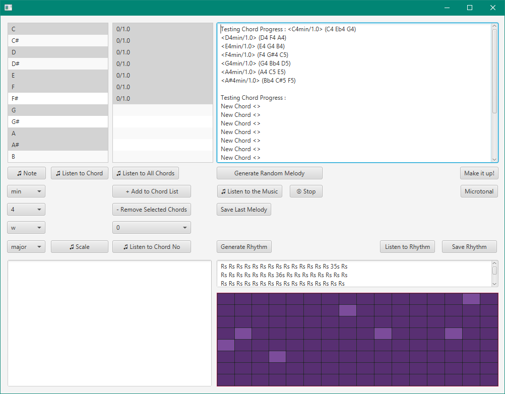

# MofComposer
An automatic music composing software writting in Java.

You select the notes and create the chords. The rest is done by the program. It generates random rhythms and a melody accordingly.

